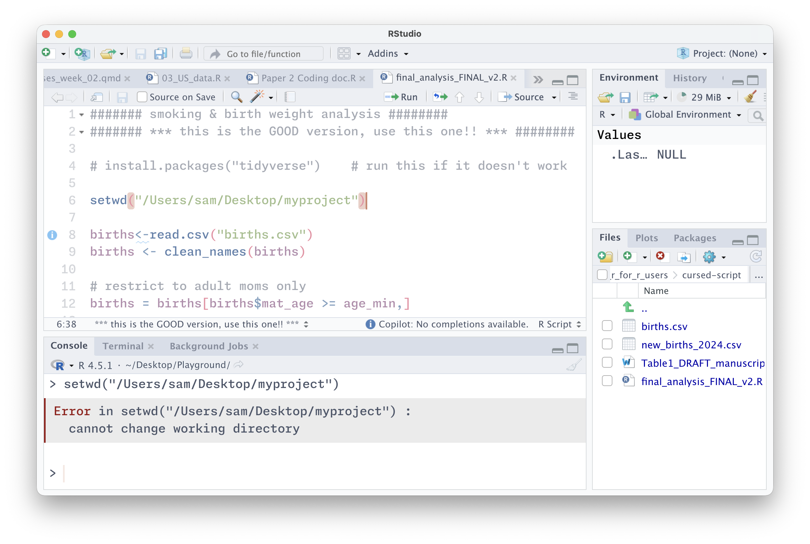
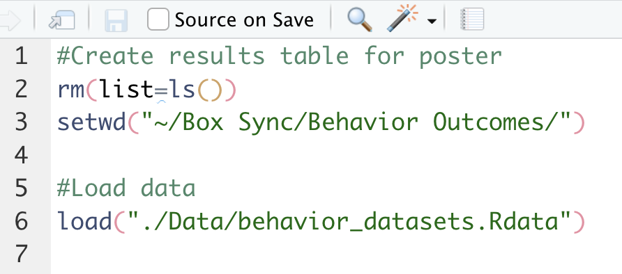
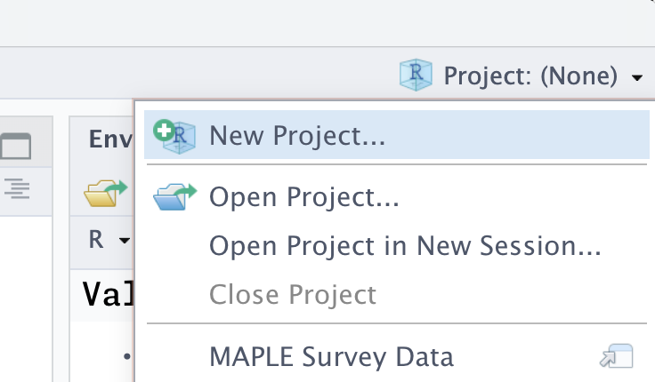
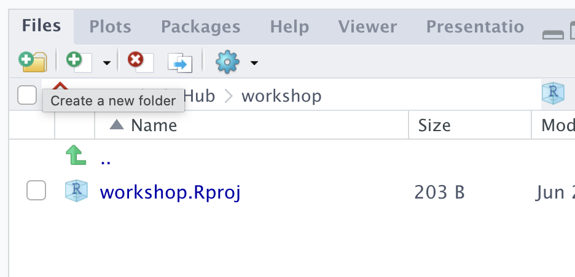
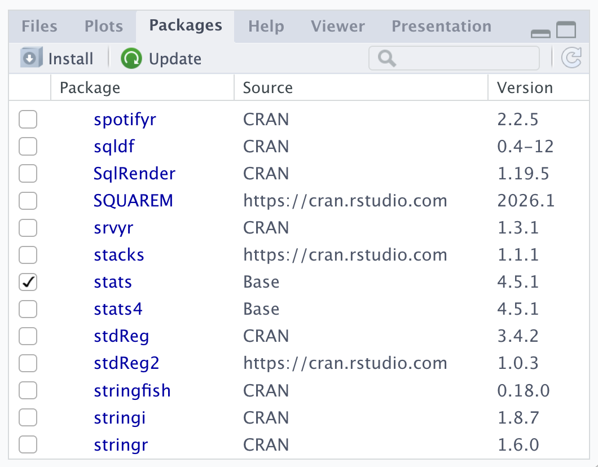
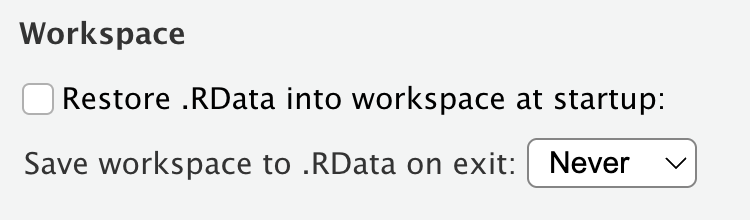
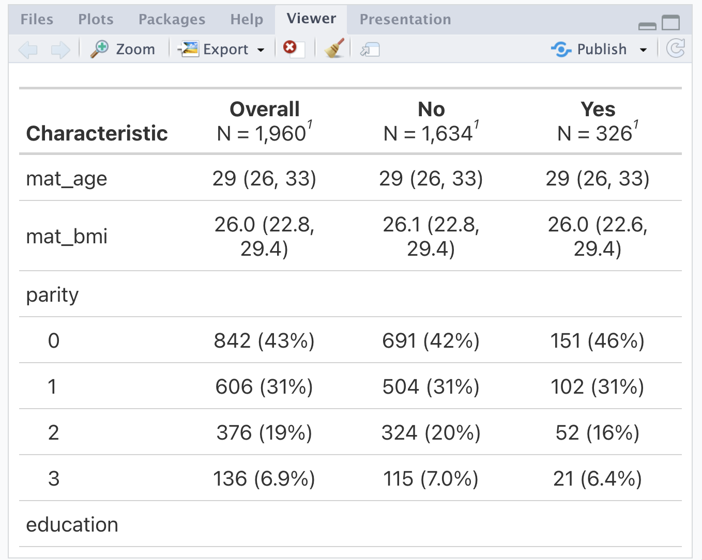

```{r setup, include=FALSE}
options(
  tibble.max_extra_cols = 6,
  tibble.width = 60
)
```

# The scenario {background-color="#23373B"}

## You inherited a script

Sam, a graduate student on your research team, just graduated and left for a new job, leaving an ongoing project to pass to you. Their analysis is "done." You get an email:

> "Here's the script -- `final_analysis_FINAL_v2.R`. It definitely works, just run it! The data's attached, plus the Table 1 doc I've been updating. Good luck! -- Sam"

. . .

Attached: `final_analysis_FINAL_v2.R`, `births.csv`, `new_births_2024.csv`, and `Table1_DRAFT_manuscript.docx`.

## You open it and start running



# Most of us have *written* a script like this

Today we'll cover good R practices to avoid leaving any of your colleagues – and possibly most importantly, your future self – in this position

## What Part 1 covers {.smaller}

- **Projects + paths** -- `here()`
- **Blank-slate R** -- why "it works on my machine" happens
- **Reproducibility** -- code that runs in order, every time
- **Code style** -- readable code, and formatters that do it for you
- **Quarto** -- analysis and write-up in one reproducible document
- **Organizing & scaling** -- scripts → Quarto → `targets`
- **Documenting** -- a README so you remember what you did...

## Two editors, same ideas

We'll work in **RStudio** today -- it's probably what you already use and it's great

. . .

But keep an eye on **Positron**: Posit's newer editor, built on VS Code. Multi-language (R *and* Python), more extensible, and where a lot of this is heading.

. . .

I'll mention a few Positron asides in case you ever want to make the switch

#

<video autoplay muted loop width="100%" style="max-width: 800px;">

<source src="https://positron.posit.co/videos/positron-hero-fast-tour.mp4" type="video/mp4">

</video>

::: {style="font-size: 0.5em; color: gray;"}
<https://positron.posit.co/>
:::

# Projects {background-color="#23373B"}

## The first line already broke

``` r
setwd("/Users/sam/Desktop/myproject")
```

::: error-output
Error in setwd("/Users/sam/Desktop/myproject") :

cannot change working directory
:::

## Do you think this code from 2015 still runs?



## The problem with `setwd()`

`setwd()` points at one exact folder on one exact computer. The moment the project moves -- a new laptop, a shared drive, *your* machine -- it's dead.

::: callout-note
A classic explainer: <https://www.tidyverse.org/blog/2017/12/workflow-vs-script/>
:::

## Better: an R Project {.smaller}

::::: columns
::: {.column width="42%"}
```
my-project/
├─ my-project.Rproj
├─ README.md
├─ data/
│   ├─ raw/
│   └─ processed/
├─ R/
└─ results/
    ├─ figures/
    └─ tables/
```
:::

::: {.column width="58%"}
- The `.Rproj` file marks the **project root** and opens RStudio *in that folder* -- no `setwd()` needed
  - It stores some settings but you never need to edit it by hand
  - Positron doesn't use `.Rproj` files, instead opening the folder as a project -- but the idea is the same
- If you share the project folder (e.g. GitHub, Dropbox, zipping and emailing), it will set the working directory wherever it's saved
:::
:::::

##



##



# Activity {background-color="#0072B2"}

- Start a new R project (**File → New Project → New Directory → New Project.**, or use the upper-right-corner drop-down)
- Add a `data` folder (either through RStudio or your file explorer)
- Move the workshop files into the appropriate places in the project folder

# File paths {background-color="#23373B"}

## The good news is that this runs now!

The bad news is that, depending on your settings, if you run it from within an RMarkdown/Quarto document, it might break

``` r
births<-read.csv("data/births.csv")
```

::: error-output
Error in file(file, "rt") : cannot open the connection

In addition: Warning message:

In file(file, "rt") :

cannot open file 'data/births.csv': No such file or directory
:::

## Paths that travel: the `here` package

`here()` builds paths **from the project root** -- the folder with the `.Rproj`.

``` r
library(here)

births <- read.csv(here("data/births.csv"))
```

. . .

- On my machine `here("data/births.csv")` becomes my full path (i.e., `/Users/l.smith/.../myproject/data/births.csv`); on yours it becomes yours
- This conversion into a full path rather than relative path means that it will work even in a Quarto document compiling in a subdirectory

## How to use `here()`

You can nest as many directories as exist in the path, and slashes are always forward:

``` r
ggplot(here("results/figures/birthweight.png"))
```

. . .

You can also pass the pieces separately -- both give the same path:

``` r
ggplot(here("results", "figures", "birthweight.png"))
```

## `here::here()` vs `library(here)`

``` r
library(here)
here("data/births.csv")
```

is the same as

``` r
here::here("data/births.csv")
```

# Activity {background-color="#0072B2"}

Start rewriting the script

- Delete the `setwd()` line, and rewrite the `read.csv()` line to use `here()`
  - You might need to `install.packages("here")` first
- Make sure you can read in the data!

# Blank-slate R {background-color="#23373B"}

## Your R session is full of invisible state

While you work, R quietly accumulates:

- **objects** you've created
- **packages** you've loaded
- a **working directory**

. . .

A script doesn't make this explicit will run for **you, today**, and break for **anyone else** -- including future you

## Hidden state: a worked example

Sam's script restricts to adult mothers:

``` r
####### smoking & birth weight analysis ########
####### *** this is the GOOD version, use this one!! *** ########

# install.packages("tidyverse")    # run this if it doesn't work

setwd("/Users/sam/Desktop/myproject")

births<-read.csv("births.csv")
births <- clean_names(births)

# restrict to adult moms only
births = births[births$mat_age >= age_min,]
```

. . .

::: error-output
Error: object 'age_min' not found
:::

## Error: object not found

Where does `age_min` come from? It's **never defined in the script**. Sam typed `age_min <- 18` in the console months ago, and it's been sitting in their environment ever since.

. . .

This is *hidden state* -- the analysis depends on something that isn't in the code.

. . .

This is also common when you are not running code top-to-bottom -- this will error in a new session even if `age_min` is defined down below.

## And it's not just objects

The same trap catches **functions**:

``` r
births <- clean_names(births)
```

::: error-output
Error in clean_names(births) : could not find function "clean_names"
:::

. . .

If a package was loaded in Sam's session but `library()` never made it into the script, or a helper function only ever lived in the console, your clean session has no idea what you mean.

## Packages

`base`, `methods`, `datasets`, `utils`, `grDevices`, `graphics`, `stats` are all loaded by default



## Referring to functions from packages

Works because `janitor` is loaded:

``` r
library(janitor)
births <- clean_names(births)
```

Works without loading all `janitor` functions

``` r
births <- janitor::clean_names(births)
```

But another `janitor` function, like `get_dupes(births)` will error

## Quick tip

::: error-output
Error: object 'Age_Min' not found
:::

::: error-output
Error in clean.names(births) : could not find function "clean.names"
:::

You are also going to get these same errors if you spell something wrong, so check for typos before going on a wild goose chase for hidden state!

## `attach()`

Sam's script does this:

::: sin
``` r
attach(births)
mean(birth_weight)     # look ma, no births$
```
:::

`attach()` dumps a **copy** of every column into your search path so you can type `birth_weight` instead of `births$birth_weight`. Tempting. Don't.

## Why `attach()` goes wrong {.smaller}

``` r
attach(births)
births$low_bw <- ifelse(births$birth_weight < 2500, 1, 0)

table(low_bw)   # Error: object 'low_bw' not found
```

. . .

The attached copy is a **snapshot**. Edit `births` and the attached `birth_weight` is now *stale* -- you're working with two versions and won't be told which.

. . .

- attach two datasets with a shared column name and one silently masks the other
- forget to `detach()` and the clutter follows you all session

Refer to columns explicitly (`births$x`, or `with()`, or stay inside dplyr).

## Start every session empty

Tell R to never save or restore your workspace:

- **Tools → Global Options → General**
- Uncheck *"Restore .RData into workspace at startup"*
- Set *"Save workspace to .RData on exit"* → **Never**



In **Positron**, this is automatic!

## `rm(list = ls())` is not a clean slate

You'll see scripts open with this to "clear everything":

::: sin
``` r
rm(list = ls())
```
:::

It deletes objects -- but it does **not** unload packages, reset options, or change the working directory. It's a false sense of safety.

. . .

::: callout-tip
The real reset: **Session → Restart R** (`Cmd/Ctrl + Shift + F10`). Do it often. A fresh process is the only true blank slate.
:::

# Activity {background-color="#0072B2"}

Hunt the hidden state

Sam's environment was full of things the script quietly depends on. Find as many as you can:

- objects used but never **defined** in the script
- functions called but never **defined**
- packages used but never **loaded** with `library()`

Just make a list for now -- we'll fix them next.

# Reproducibility {background-color="#23373B"}

## Code runs in the order it's written

...not the order you happened to run things in. Sam's script draws a figure near the top:

``` r
ggplot(plot_data, aes(x = smoker, y = birth_weight)) +
  geom_boxplot()
```

. . .

...but `plot_data` isn't created until **30 lines later**:

``` r
plot_data = births   # defined AFTER the figure that uses it
```

Sam ran the cells out of order in a live session. It "worked" because by then `plot_data` happened to exist.

## Same story with packages

``` r
ggplot(plot_data, ...)   # line 28

library(tidyverse)       # line 40 -- ggplot lives here!
```

. . .

The `library()` call exists -- it's just in the wrong place. In Sam's session the package was already loaded, so the figure ran. In a fresh session it errors: `could not find function "ggplot"`.

. . .

**Load every package at the top.**

## The fix is just... order

A script should read top to bottom like a recipe: **load → read → clean → model → report**. Nothing is used before it exists.

``` r
library(tidyverse)
library(here)

births <- read_csv(here("data/raw/births.csv")) |>
  clean_births(age_min = 18)

# now plot it -- the data exists
ggplot(births, aes(x = smoker, y = birth_weight)) +
  geom_boxplot()
```

## Reproducible = re-runnable from scratch

A reproducible analysis can be re-run from nothing and give the same result -- by you, by a reviewer, by you in two years.

That needs:

- **self-contained paths** (`here()`),
- a **clean session** (no hidden state),
- code in **runnable order**

## Two more reproducibility levers

These won't show up today, but you'll hit both in real work -- so know they exist.

. . .

- **Randomness** -- anything random gives different answers each run unless you pin it down.
- **Package versions** -- "it worked last year" can fail after an update.

## Randomness needs a seed

Bootstraps, multiple imputation, train/test splits, simulations, `sample()` -- re-run them and you get *different numbers* every time.

``` r
set.seed(20260615)

boot_samples <- map(1:1000, \(i) slice_sample(births, prop = 1, replace = TRUE))
```

. . .

`set.seed()` once, near the top, makes the randomness repeatable. Pick an random integer -- the point is that it's **written down**, so your confidence interval is the same tomorrow.

## Your packages are part of the environment

Blank-slate R handles your objects and which packages are loaded. But it doesn't pin **which versions**.

. . .

``` r
# code written under dplyr 1.0...
df |> summarise(n = n(), .by = group)   # ...errors on older dplyr
```

"Works on my machine" is often really "works with *my* package versions." For an analysis you'll revisit, share, or publish, that's a reproducibility hole.

## `renv`: a lockfile for your project

`renv` gives each project its **own library** and records exact versions in a `renv.lock` file that travels with the project.

``` r
renv::init()        # start tracking this project's packages
renv::snapshot()    # record current versions to renv.lock
renv::restore()     # reproduce that exact set on another machine
```

. . .

We're not going to practice this, but TODO renv resources

# Activity {background-color="#0072B2"}

Make it run, start to finish

1.  Move `library()` calls to the top; move the figure **after** the data it plots.
2.  Fix the hidden state you found previously (define the objects, load the packages, replace Sam's helper).
    - set `min_age` to 18, `bad_ids` to 1:3, `bw_cutoff` to 2500, and replace `make_or_table()` with `tidy()`
3.  **Restart R** (`Cmd/Ctrl + Shift + F10`) for a clean slate.
4.  Source the whole script. Read the first error, fix it, repeat until you get rid of as many errors as possible (there will still be 1 you can't fix -- see if you can figure out why!)

# Code style {background-color="#23373B"}

## Style is for humans

The code runs either way. Style is what makes it **readable, reviewable, and hard to break** -- by collaborators, reviewers, and future you.

. . .

This is *separate* from code that's wrong or unsafe. We're talking about formatting and naming here, not correctness.

## Ugly, unreadable code

``` r
d2=read.csv('f.csv');d2$x2<-d2$x*1.8+32;m=lm(y~x2+grp,d2)
```

What does this do? Who knows. One line, three statements, cryptic names, no spaces, mixed assignment.

Instead you might write

``` r
data_f <- read.csv('f.csv')
multiplier <- 1.8
baseline <- 32
data_f$corrected_x <- data_f$x * multiplier + baseline
mod_y <- lm(y ~ corrected_x + grp, data_f)
```

## More bad habits

``` r
# inconsistent naming -- pick a lane!
MatAge <- d$mat_age
birth.weight <- d$birthWeight
n_Obs <- nrow( d )

# magic numbers with no explanation
d <- d[d$v3 > 2500 & d$v7 < 37, ]

# the commented-out graveyard
# m1 <- lm(y ~ x)
# m2 <- lm(y ~ x + z)
# m3 <- lm(y ~ x + z + w)   # this one? maybe?
```

## Habits worth keeping {.smaller}

- **One statement per line**; let long calls breathe across lines
- **Spaces** around operators: `x + 1`, not `x+1`
- **`<-`** for assignment (the tidyverse convention), reserve `=` for arguments
- **Consistently cased** names that mean something
- **Indent** nested code; delete dead commented-out code (save in separate file?)
- Keep lines short enough to read without scrolling

::: callout-note
Reference: <https://r4ds.hadley.nz/workflow-style>
:::

## Don't do it by hand -- use a formatter {.smaller}

::::: columns
::: {.column width="50%"}
**styler** (R package)

``` r
install.packages("styler")
```

- RStudio → **Addins → Style active file**
- or `styler::style_file("R/01_clean.R")`
- <https://styler.r-lib.org>
:::

::: {.column width="50%"}
**Air** (newer, very fast)

- Format-on-save in your editor
- **Built into Positron**; RStudio & VS Code via extension
- <https://posit-dev.github.io/air/>
:::
:::::

. . .

Pick one and be consistent. The point isn't *which* -- it's that the machine keeps the formatting tidy so code review is about ideas, not whitespace.

# Activity {background-color="#0072B2"}

Clean it up

1.  Install and run `styler::style_file()` on your script (Addins → Style active file), or install Air and format document.
2.  Look at the diff -- what did the formatter change for you?
3.  Now fix what a formatter **won't**: cryptic names, `=` → `<-` inconsistency, magic numbers, anything else that's not aesthetically pleasing to you!

# Reproducible reporting {background-color="#23373B"}

##  {background-color="#23373B"}

::: {style="font-size:1.4em"}
**Plot twist** 🔌
:::

*"Restrict to mothers aged 20 and older, not 18."*

. . .

Change `age_min <- 20` in **one** place, re-run, and every number updates.

. . .

...except the ones Sam hand-typed into `Table1_DRAFT_manuscript.docx`. Those are now **wrong**, and nothing tells you

## Sam's "report" was copy-paste

Sam's script is full of this:

``` r
print(table(births$low_bw, births$smoker))
print(round(prop.table(...), 3))
print(mean(births$mat_age))
```

Numbers got `print()`ed (NB: you do not need to write `print()` in this situation!), then **hand-typed into a Word doc**. Re-run the analysis (or change the inclusion criteria...) and every number in that doc is now a lie waiting to be caught in proofs.

## First, let R build the table

Instead of typing Table 1 by hand, generate it with **gtsummary** or a similar package:

``` r
library(gtsummary)

table1 <- births |>
  select(smoker, mat_age, mat_bmi, parity, education, low_bw, preterm) |>
  tbl_summary(by = smoker) |>
  add_overall()
```

. . .

One function, a real Table 1, recomputed from the data every time. Change the data and the table changes with it.

##



## Quarto: code and write-up in one file

A Quarto document (`.qmd`) weaves prose, code, and output together, then renders to HTML, Word, or PDF.

``` yaml
---
title: "Smoking and birth weight"
format: html
execute:
  echo: false
---
```

Markdown for text; code chunks for analysis:

```` markdown
```{{r}}
births <- read_csv(here("data/births.csv"))
```
````

## Quarto vs. RMarkdown?

TODO

## Numbers that never go stale

Report results with **inline code** instead of typing them:

``` markdown
There were {r} nrow(births) participants in the study. TODO FIX
```

::: fragment
That `` `r ` `` chunk runs when the document renders and drops the number straight into the sentence. Change the data, re-render, and the prose updates itself -- no more hand-typed numbers.
:::

## You can pull numbers directly from tables

```markdown
TODO inline_code(table1)
```

## Rendering = the blank-slate test, for free

When you click **Render**, Quarto runs the whole document in a **fresh R session, top to bottom**.

. . .

::: callout-tip
If your `.qmd` renders, it's reproducible by construction -- hidden state and out-of-order code can't survive a render. That alone is a great reason to move analyses into Quarto.
:::


# Activity 5 {background-color="#0072B2"}

## Turn the analysis into a report

1.  **File → New File → Quarto Document.**
2.  Move your cleaning + model code into code chunks.
    - You can omit the sensitivity analysis section for now
3.  Replace Sam's hand-typed Table 1 with `tbl_summary()`.
4.  Write one sentence of results using **inline R code** (about whatever you want).
5.  Click **Render**, then change `age_min` and re-render. Watch every number -- table and text -- update itself.

# Organizing & scaling {background-color="#23373B"}

## One script that does everything

Sam's script reads, cleans, plots, models, and saves -- all in one file, top to bottom. For a small analysis, honestly, that's fine!

. . .

The strain shows up as it grows:

- you scroll forever to find the modeling code
- re-running the figure means re-running the slow cleaning too
- two people can't edit it without colliding

. . .

There's no single right answer. Here are four options, lightest to heaviest -- pick what works for you

## 1. Numbered scripts + a runner

```
R/00_setup.R     # packages, options, source functions
R/01_clean.R     # raw data  ->  analysis data
R/02_analysis.R  # fit models
R/03_outputs.R   # tables, figures
run_all.R        # source() them in order
```

Transparent, no new tools. A great default for most projects.

## 2. One Quarto document

Everything -- cleaning, models, write-up -- in a single `.qmd`.

. . .

Best when the analysis *is* the deliverable: a report, a paper, a homework assignment. One file renders to the finished document.

## 3. A Quarto report, assembled from sections

``` markdown
{}
{}
```

A parent document pulls in section files that share one R session.

. . .

Good when a document gets unwieldy, or co-authors each own a section without scrolling through the whole manuscript.

::: callout-note
This is basically how I wrote my dissertation (with RMarkdown)!
:::

## 4. A `targets` pipeline

`targets` tracks what each step depends on and **only re-runs what changed**.

``` r
list(
  tar_target(births_file, here("data/raw/births.csv"), format = "file"),
  tar_target(births,      clean_births(read_births(births_file))),
  tar_target(lbw_model,   fit_lbw_model(births)),
  tar_target(bw_plot,     plot_birthweight(births))
)
```

## Why `targets`?

Edit the figure and re-run -- a slow model **does not need to be refit**. Change the raw data file and everything downstream knows it's out of date.

``` r
targets::tar_visnetwork()   # see the dependency graph
targets::tar_make()         # build only what's stale
```

. . .

Overkill for today's tiny analysis. Worth it when steps are slow, numerous, or re-run constantly.

## `targets`

TODO: add lecture content

# Activity 6 {background-color="#0072B2"}

## Split it up

Carve your working script into numbered pieces and saave them into the appropriate directory:

1.  `R/00_setup.R` -- `library()` calls and `theme_set()`
2.  `R/01_clean.R` -- read + clean the data
3.  `R/02_analysis.R` -- fit the models
4.  `run_all.R` -- `source()` them in order
    - make sure you are referring to the file paths where they are saved!

Restart R and source `run_all.R`. Does it run clean?

# Documenting your project {background-color="#23373B"}

## The one thing Sam didn't leave you

You've spent this whole session reverse-engineering a script with no instructions: guessing what `age_min` was, where the data came from, how to run the thing.

. . .

A **README** would have answered most of that in 30 seconds.

. . .

It's a plain text or markdown file (`README.md`) at the project root. Be the colleague you wish Sam had been.

## What goes in a README {.smaller}

It doesn't have to be long -- even ten lines beats nothing:

- **What** the project is and what question it answers
- **Data** -- where it came from, and "raw is read-only"
- **How to run it** -- open the `.Rproj`, restart R, source `run_all.R`
- **Project structure** -- the folder map
- **Key decisions** -- including those magic numbers (`age_min`, the LBW cutoff)
- **Requirements** -- packages needed (this is where `renv` pays off)

. . .

::: callout-tip
Write it for the person who inherits this in two years. That person is usually you.
:::

# Activity 7 {background-color="#0072B2"}

## Write the README {.smaller}

Create a `README.md` at your project root. Cover:

- what the analysis does
- where the data come from
- how to run it (open `.Rproj` → restart R → source `run_all.R`)
- the key analysis choices -- `age_min`, the low-birth-weight cutoff


# Wrap-up {background-color="#23373B"}

## Before and after

**Before:** one file, hard-coded paths, hidden state, code out of order, results typed into Word by hand. Broke on the first line.

. . .

**After:** an R Project anyone can open and run from a clean session -- paths that travel, code in order, tables and numbers that rebuild themselves, and a choice of ways to organize and report it.

## The habits worth keeping {.smaller}

- One R **Project** per analysis; paths via **`here()`**
- Start every session **blank**; restart often
- Code that runs **top to bottom** in a fresh session
- Let a **formatter** keep the style tidy
- **Quarto** so your numbers never go stale; pick the **organization** that fits
- A **README** so the next person (probably you) isn't reverse-engineering it

## On to Part 2

Your project runs and reports itself.

. . .

But code still breaks. Part 2: **how to debug it systematically, and how to ask for help** that actually gets you unstuck.
