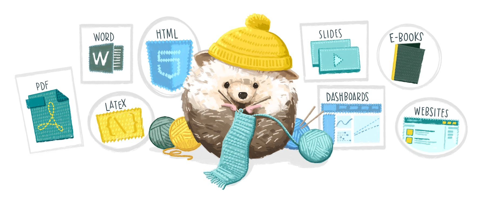
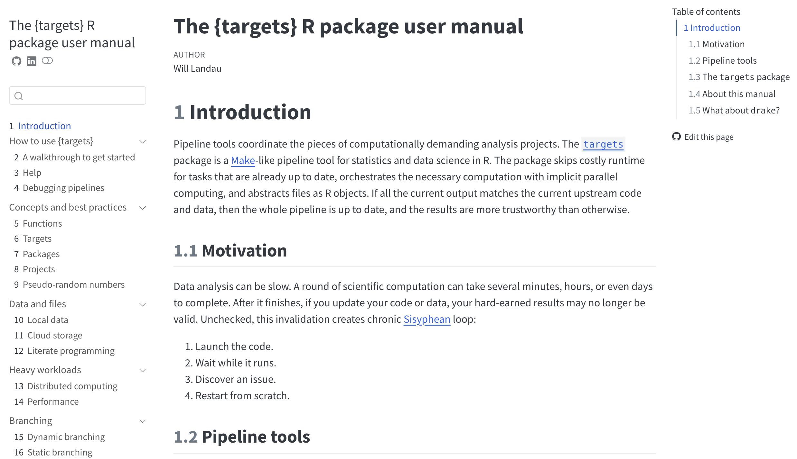

```{r setup, include=FALSE}
options(
  tibble.max_extra_cols = 6,
  tibble.width = 60
)
```

# The scenario {background-color="#23373B"}

## You inherited a script

Sam, a graduate student on your research team, just graduated and left for a new job, leaving an ongoing project to pass to you. Their analysis is "done." You get an email:

> "Here's the script -- `final_analysis_FINAL_v2.R`. It definitely works, just run it! The data's attached, plus the Table 1 doc I've been updating. Good luck! -- Sam"

. . .

Attached: `final_analysis_FINAL_v2.R`, `births.csv`, and `Table1_DRAFT_manuscript.docx`.

## You open it and start running


# Most of us have *written* a script like this

Today we'll cover good R practices to avoid leaving any of your colleagues – and possibly most importantly, your future self – in this position

## What Part 1 covers {.smaller}

- **Projects + paths** -- `here()`
- **Blank-slate R** -- why "it works on my machine" happens
- **Reproducibility** -- code that runs in order, every time
- **Code style** -- readable code, and formatters that do it for you
- **Quarto** -- analysis and write-up in one reproducible document
- **Organizing & scaling** -- scripts → Quarto → `targets`
- **Documenting** -- a README so you remember what you did...

## Two editors, same ideas

We'll work in **RStudio** today -- it's probably what you already use and it's great

. . .

But I'll also mention **Positron**: Posit's newer editor, built on VS Code. Multi-language (including R and Python), more extensible, and has some things we'll discuss built in

```{=html}
<!-- #

<video autoplay muted loop width="100%" style="max-width: 800px;">

<source src="https://positron.posit.co/videos/positron-hero-fast-tour.mp4" type="video/mp4">

</video>

::: {style="font-size: 0.5em; color: gray;"}
<https://positron.posit.co/>
::: -->
```

# Projects {background-color="#23373B"}

## The first line already broke

``` r
setwd("/Users/sam/Desktop/myproject")
```

::: error-output
Error in setwd("/Users/sam/Desktop/myproject") :

cannot change working directory
:::

## Do you think this code from 2015 still runs?

A researcher doing a meta-analysis reached out years later for some data...


## The problem with `setwd()`

`setwd()` points at one exact folder on one exact computer. The moment the project moves -- a new laptop, a shared drive, *your* machine -- it will break

::: callout-note
A classic explainer: <https://www.tidyverse.org/blog/2017/12/workflow-vs-script/>
:::

## Better: an R Project {.smaller}

::::: columns
::: {.column width="42%"}
```
my-project/
├─ my-project.Rproj
├─ README.md
├─ data/
│   ├─ raw/
│   └─ processed/
├─ R/
└─ results/
    ├─ figures/
    └─ tables/
```
:::

::: {.column width="58%"}
- The `.Rproj` file marks the **project root** and opens RStudio *in that folder* -- no `setwd()` needed
  - It stores some settings but you never need to edit it by hand
  - Positron doesn't use `.Rproj` files, instead opening the folder as a project -- but the idea is the same
- If you share the project folder (e.g. GitHub, Dropbox, zipping and emailing), it will set the working directory wherever it's saved
:::
:::::

## Always open a project by opening the `.Rproj` file

::: panel-tabset
## Mac

{width="500"}

## Windows

{width="500"}
:::

You can have multiple projects open at once in different RStudio sessions!

## You can also switch between R projects from RStudio


- Clicking the arrow icon will open it up in a new session and keep your current session open
- Opening an R project will also open all the files you had open last time (including unsaved "Untitled" files!)

##


## Set up the project {.activity-slide background-color="#0072B2"}

:::nonincremental
- Start a new R project (**File → New Project → New Directory → New Project.**, or use the upper-right-corner drop-down)
- Add a `data` folder (either through RStudio or your file explorer)
- Move the files from Sam into the appropriate places in the project folder
:::

# File paths {background-color="#23373B"}

## The good news is that this runs now!

The bad news is that there are still ways it might break (e.g., depending on your settings, if you are trying to read it in from an R Markdown or Quarto document in a subfolder)

``` r
births<-read.csv("data/births.csv")
```

::: error-output
Error in file(file, "rt") : cannot open the connection

In addition: Warning message:

In file(file, "rt") :

cannot open file 'data/births.csv': No such file or directory
:::

## Paths that travel: the `here` package

`here()` builds paths **from the project root** -- the folder with the `.Rproj`.

``` r
library(here)

births <- read.csv(here("data/births.csv"))
```

. . .

- On my machine `here("data/births.csv")` becomes my full path (i.e., `/Users/l.smith/.../myproject/data/births.csv`); on yours it becomes yours
- This conversion into a full path rather than relative path means that it will work even in a Quarto document compiling in a subdirectory

## How to use `here()`

You can nest as many directories as exist in the path, and slashes are always forward:

``` r
ggplot(here("results/figures/birthweight.png"))
```

. . .

You can also pass the pieces separately -- both give the same path:

``` r
ggplot(here("results", "figures", "birthweight.png"))
```

## `here::here()` vs `library(here)`

``` r
library(here)
here("data/births.csv")
```

is the same as

``` r
here::here("data/births.csv")
```

::: callout-note
You can do this with any function from any package -- we'll talk more about it in a bit
:::

## Start rewriting the script {.activity-slide background-color="#0072B2"}

Save a new, better version to work on.

:::nonincremental
- Delete the `setwd()` line, and rewrite the `read.csv()` line to use `here()`
  - You might need to `install.packages("here")` first
- Run that line to make sure you can read in the data!
:::

# Blank-slate R {background-color="#23373B"}

## Your R session is full of invisible state

While you work, R quietly accumulates:

- **objects** you've created
- **packages** you've loaded
- a **working directory**

. . .

A script doesn't make this explicit will run for **you, today**, and break for **anyone else** -- including future you

## Hidden state {.compact}

Sam's script restricts to adult mothers:

``` r
####### smoking & birth weight analysis ########
####### *** this is the GOOD version, use this one!! *** ########

# install.packages("tidyverse")    # run this if it doesn't work

setwd("/Users/sam/Desktop/myproject")

births<-read.csv("births.csv")
births <- clean_names(births)

# restrict to adult moms only
births = births[births$mat_age >= age_min,]
```

. . .

::: error-output
Error: object 'age_min' not found
:::

## Error: object not found

. . .

Where does `age_min` come from? It's **never defined in the script**. Sam typed `age_min <- 18` in the console months ago, and it's been sitting in their environment ever since.

. . .

This is *hidden state* -- the analysis depends on something that isn't in the code.

. . .

This is also common when you are not running code top-to-bottom -- this will error in a new session if `age_min` is defined below the code where it's used.

## And it's not just objects

The same trap catches **functions**:

``` r
births <- clean_names(births)
```

::: error-output
Error in clean_names(births) : could not find function "clean_names"
:::

. . .

If a package was loaded in Sam's session but `library()` never made it into the script, or a helper function was defined in the console or by running code from a new script, your clean session has no idea what you mean.

## What Sam might have been doing...


## Packages {.smaller}

`base`, `methods`, `datasets`, `utils`, `grDevices`, `graphics`, `stats` are all loaded by default


::: {.columns}

::: {.column width="65%"}


:::

::: {.column width="35%"}

You can use the packages pane to see what packages you have loaded or their versions, but don't load them this way -- make sure to `library()` them in your script so anyone else can run it too

:::

:::


## Referring to functions from packages

Works because `janitor` is loaded:

``` r
library(janitor)
births <- clean_names(births)
```

Works without loading all `janitor` functions, which is fine if this is all you need:

``` r
births <- janitor::clean_names(births)
```

But another `janitor` function, like `get_dupes(births)` will error

## Quick tip

::: error-output
Error: object 'Age_Min' not found
:::

::: error-output
Error in clean.names(births) : could not find function "clean.names"
:::

You are also going to get these same errors if you spell something wrong, so check for typos before going on a wild goose chase for hidden state! Similarly:

```r
install.packages("jantor")
```
:::error-output
Warning message:
package ‘jantor’ is not available for this version of R

A version of this package for your version of R might be available elsewhere,
see the ideas at
https://cran.r-project.org/doc/manuals/r-patched/R-admin.html#Installing-packages
:::

## Start every session empty {.smaller}

Tell R to never save or restore your workspace:

::: nonincremental
- **Tools → Global Options → General**
- Uncheck *"Restore .RData into workspace at startup"*
- Set *"Save workspace to .RData on exit"* → **Never**
:::


(In **Positron**, this is automatic!)

## `rm(list = ls())` is not a clean slate

You'll see scripts open with this to "clear everything":

::: sin
``` r
rm(list = ls())
```
:::

It deletes objects -- but it does **not** unload packages, reset options, or change the working directory. It's a false sense of safety.

. . .

::: callout-tip
The real reset: **Session → Restart R** (`Cmd/Ctrl + Shift + F10`). Do it early and do it often.
:::

## `attach()`

Sam's script does this:

``` r
attach(births)
mean(birth_weight)     # birth_weight is a variable in births
```

`attach()` dumps a **copy** of every column into your search path so you can type `birth_weight` instead of `births$birth_weight`. Tempting. Avoid!

## Why `attach()` goes wrong {.smaller}

``` r
attach(births)
births$low_bw <- ifelse(births$birth_weight < 2500, 1, 0)

table(low_bw)   # Error: object 'low_bw' not found
```

. . .

The attached copy is a **snapshot**. Edit `births` and the attached `birth_weight` is now *stale* -- you're working with two versions and won't be told which.

. . .

::: {.nonincremental}
- attach two datasets with a shared column name and one silently masks the other
- forget to `detach()` and the clutter follows you all session

Refer to columns explicitly (`births$x`, or `with()`, or stay inside dplyr functions).
:::

## Hunt the hidden state {.activity-slide background-color="#0072B2"}

Sam's environment was full of things the script quietly depends on. Find as many as you can:

::: nonincremental
- objects used but never **defined** in the script
- functions called but never **defined**
- packages used but never **loaded** with `library()`
:::

Just make a list for now -- we'll fix them next.

# Reproducibility {background-color="#23373B"}

## Code runs in the order it's written

...not the order you happened to run things in. Sam's script draws a figure near the top:

``` r
ggplot(plot_data, aes(x = smoker, y = birth_weight)) +
  geom_boxplot()
```

. . .

...but `plot_data` isn't created until **30 lines later**:

``` r
plot_data = births   # defined AFTER the figure that uses it
```

Sam ran the code out of order in a live session (this is very common when developing code!). It "worked" because by then `plot_data` happened to exist.

## Same story with packages

``` r
ggplot(plot_data, ...)   # line 28

library(tidyverse)       # line 40 -- ggplot lives here!
```

. . .

The `library()` call exists -- it's just in the wrong place. In Sam's session the package was already loaded, so the figure ran. In a fresh session it errors: `could not find function "ggplot"`.

. . .

**Load every package at the top.**

## The fix is just... order

A script should read top to bottom like a recipe.

For example: **load → read → clean → model → report**.

``` r
library(tidyverse)
library(here)

births <- read_csv(here("data/raw/births.csv")) |>
  clean_births(age_min = 18)

ggplot(births, aes(x = smoker, y = birth_weight)) +
  geom_boxplot()
```

## Reproducible = re-runnable from scratch

A reproducible analysis can be re-run from nothing and give the same result -- by you, by a reviewer, by you in two years.

That needs:

- **self-contained paths** (`here()`),
- a **clean session** (no hidden state),
- code in **runnable order**

## Two more reproducibility concerns

These won't show up today, but you'll hit both in real work -- so know they exist.

- **Randomness** -- anything random gives different answers each run unless you pin it down.
- **Package versions** -- "it worked last year" can fail after an update.

## Randomness needs a seed

Bootstraps, multiple imputation, train/test splits, simulations, `sample()` -- re-run them and you get *different numbers* every time.

``` r
set.seed(20260615)

boot_samples <- map(1:1000, \(i) slice_sample(births, prop = 1, replace = TRUE))
```

. . .

`set.seed()` once, near the top, makes the randomness repeatable. Pick an random integer -- the point is that it's **written down**, so your confidence interval is the same tomorrow.

::: callout-note
Some functions/workflows, such as those that are parallelized, may have more complex ways to deal with random seeds
:::

## Your packages are part of the environment

Blank-slate R handles your objects and which packages are loaded. But it doesn't pin **which versions**.

. . .

``` r
# code written under dplyr 1.0...
df |> summarise(n = n(), .by = group)   # ...errors on older dplyr
```

"Works on my machine" is often really "works with *my* package versions." For an analysis you'll revisit, share, or publish (so all of them?), that's a reproducibility hole.

## `renv`: a lockfile for your project

`renv` gives each project its **own library** and records exact versions in a `renv.lock` file that travels with the project.

``` r
renv::init()        # start tracking this project's packages
renv::snapshot()    # record current versions to renv.lock
renv::restore()     # reproduce that exact set on another machine
```

## The `renv.lock` file


::: {.columns}

::: {.column width="55%"}
```
{
  "R": {
    "Version": "4.3.1",
    "Repositories": [
      {
        "Name": "CRAN",
        "URL": "https://cloud.r-project.org"
      }
    ]
  },
  "Packages": {
    "dplyr": {
      "Package": "dplyr",
      "Version": "1.2.0",
      "Source": "Repository",
      "Repository": "CRAN",
      "Hash": "e3f4c5a6b7d8e9f0a1b2c3d4e5f6g7h8"
    },
    ...
  }
}
```
:::

::: {.column width="45%"}

We're not going to practice this, but there is helpful documentation: <https://rstudio.github.io/renv/articles/renv.html>


:::

:::


## Make it run, start to finish {.activity-slide background-color="#0072B2"}

:::nonincremental
1.  Move `library()` calls to the top; move the figure **after** the data it plots.
2.  Fix the hidden state you found previously (define the objects, load the packages, replace Sam's helper).
    - set `min_age` to 18, `bad_ids` to 1:3, `bw_cutoff` to 2500, and replace `make_or_table()` with `tidy()`
3.  **Restart R** (`Cmd/Ctrl + Shift + F10`) for a clean slate.
4.  Source the whole script. Read the first error, fix it, repeat until you get rid of as many errors as you can.
:::

# Code style {background-color="#23373B"}

## Style is for humans

The code runs either way. Style is what makes it **readable, reviewable, and hard to break** -- by collaborators, reviewers, and future you.

. . .

This is *separate* from code that's wrong or unsafe. We're talking about formatting and naming here, not correctness.

## Ugly, unreadable code {.compact}

``` r
d2=read.csv('f.csv');d2$x2<-d2$x*1.8+32;m=lm(y~x2+grp,d2)
```

What does this do? Who knows. One line, three statements, cryptic names, no spaces, mixed assignment.

Instead you might write:

``` r
data_f <- read.csv('f.csv')
baseline <- 32
x_multiplier <- 1.8
data_f$corrected_x <- data_f$x * x_multiplier + baseline
mod_y <- lm(y ~ corrected_x + grp, data = data_f)
```

## More bad habits {.compact}

``` r
# inconsistent naming, spacing, and assignment
MatAge <- d$mat_age
birth.weight<-d$birthWeight
n_Obs = nrow( d )

# magic numbers with no explanation
d <- d[d$v3 > 2500 & d$v7 < 37, ]

# the commented-out graveyard
# m1 <- lm(y ~ x)
# m2 <- lm(y ~ x + z)
# m3 <- lm(y ~ x + z + w)   # this one? maybe?

# T/F abbreviations
T <- 34
if (x == T) {...}
```

## Habits worth considering {.smaller}

- **One statement per line**; let long calls breathe across lines
- **Spaces** around operators: `x + 1`, not `x+1`
- **`<-`** for assignment (the tidyverse convention), reserve `=` for arguments
- **Consistently cased** names that mean something
- **Indent** nested code; delete dead commented-out code (save in separate file?)
- Keep lines short enough to read without scrolling

. . .

::: callout-note
Reference: <https://r4ds.hadley.nz/workflow-style>
:::

## Don't do it by hand -- use a formatter {.smaller}

::::: columns
:::: {.column width="50%"}
**styler** (R package)


``` r
install.packages("styler")
```
:::nonincremental
- RStudio → **Addins → Style active file**
- or `styler::style_file("script.R")`
- <https://styler.r-lib.org>
:::
::::

:::: {.column width="50%"}
**Air** (newer, very fast)

:::nonincremental
- Format-on-save in your editor
- **Built into Positron**
- Install for use in RStudio: <https://posit-dev.github.io/air/editor-rstudio.html>
  - (can't use in Quarto documents in RStudio yet)
:::
::::
:::::


## Clean it up {.activity-slide background-color="#0072B2"}

:::nonincremental
1.  Install and run `styler::style_file()` on your script (Addins → Style active file), or install Air and format document.
2.  Compare before and after!
3.  Now fix what a formatter **won't**: cryptic names, `=` → `<-` inconsistency, magic numbers, anything else that's not aesthetically pleasing to you!
:::

# Reproducible reporting {background-color="#23373B"}

##  Plot twist

*"Restrict to mothers aged 20 and older, not 18."*

. . .

Change `age_min <- 20` in **one** place, re-run, and every number updates.

. . .

...except the ones Sam hand-typed into `Table1_DRAFT_manuscript.docx`. Those are now **wrong**, and nothing tells you

## Sam's "report" was copy-paste {.smaller}

Sam's script is full of this:

``` r
print(table(births$low_bw, births$smoker))
print(round(prop.table(...), 3))
print(mean(births$mat_age))
```

Numbers got `print()`ed (NB: you do not need to write `print()` in this situation!), then **hand-typed into a Word doc**.

Change the inclusion criteria or update the data and every number in the tables and text now needs to be updated by hand

## First, let R build the table

Instead of typing Table 1 by hand, generate it with **gtsummary** or a similar package:

``` r
library(gtsummary)

table1 <- births |>
  select(smoker, mat_age, mat_bmi, parity, education, low_bw, preterm) |>
  tbl_summary(by = smoker) |>
  add_overall()
```

. . .

One function, a real Table 1, recomputed from the data every time. Change the data and the table changes with it!

##


## Generate Table 1 {.activity-slide background-color="#0072B2"}

:::nonincremental
- Add a `tbl_summary()` call to your script to generate Table 1
- Run the code with `age_min` set to 18, then with `age_min` set to 20
- Open up the browser version of the table and copy into a Word doc
:::

# Quarto {background-color="#23373B"}

## Why not R Markdown?

Only because Quarto is newer and more featured!

- Anything you already know how to do in R Markdown you can do in Quarto, and more!
- All of these slides are made in Quarto.
- If you know and love R Markdown, by all means keep using it!

## Quarto: code and write-up in one file

A Quarto document (`.qmd`) weaves prose, code, and output together, then renders to HTML, Word, or PDF.

``` yaml
---
title: "Smoking and birth weight"
format: html
execute:
  echo: false
---
```

Markdown for text; code chunks for analysis:

````
```{{r}}
births <- read_csv(here("data/births.csv"))
```
We conducted a really *important* study...
````

## How does it work? {.smaller}

- You write text in markdown and code in R
- `knitr` processes the code chunks, executes the R code, and inserts the code outputs (e.g., plots, tables) back into the markdown document
- `pandoc` transforms the markdown document into various output formats


## Text and code...

````
# My header

Some text

Some *italic text*

Some **bold text**

- Eggs
- Milk

```{{r}}
x <- 3
x
```
````

## ... becomes ...

### My title

Some text

Some *italic text*

Some **bold text**

:::nonincremental
- Eggs
- Milk
:::

```{r}
x <- 3
x
```

## If you prefer, you can use the visual editor


## R chunks {.smaller .compact}

Everything within the chunks has to be valid R[^1]

[^1]: You can also use other languages, like Python!

```{r}
#| echo: fenced
x <- 3
```

Chunks run in order, continuously, like a single script, from a fresh session

```{r}
#| echo: fenced
x + 4
```

## Quarto workflow

1.  Create a Quarto document
2.  Write code
3.  Write text
4.  Repeat 2-3 in whatever order you want
5.  Render repeatedly as you go

## YAML

At the top of your Quarto document, a header written in *yaml* describes options for the document

``` yml
---
title: "My document"
author: Louisa Smith
format: html
---
```

There are a *ton* of possible options, but importantly, this determines the document output

## Output



<https://quarto.org/docs/output-formats/all-formats.html>

## Numbers that never go stale

Report results with **inline code** instead of typing them:

```
There were `r knitr::inline_expr("nrow(births)")` participants in the study.
```

. . .

There were 1960 participants in the study.

. . .

That `` `r ` `` chunk runs when the document renders and drops the number straight into the sentence. Change the data, re-render, and the prose updates itself -- no more hand-typed numbers.

## You can pull numbers directly from tables

``` markdown
The median material age was `r knitr::inline_expr('inline_text(table1, variable = "mat_age", \ncolumn = "stat_0")')`.
```

. . .

The median maternal age was 29 (26, 33).

. . .

::: callout-note
`inline_text()` is a helper that pulls a specific value from the table. A tutorial is available here: <https://www.danieldsjoberg.com/gtsummary/articles/inline_text.html>
:::

## Rendering = the blank-slate test, for free

When you click **Render**, Quarto runs the whole document in a **fresh R session, top to bottom**.

. . .

::: callout-tip
If your `.qmd` renders, it's reproducible by construction -- hidden state and out-of-order code can't survive a render. That alone is a great reason to move analyses into Quarto.
:::

## Turn the analysis into a report {.activity-slide background-color="#0072B2"}

:::nonincremental
1.  **File → New File → Quarto Document.**
2.  Move your cleaning + model + table code into code chunks.
3.  Write one sentence of results using **inline R code** (about whatever you want).
4.  Click **Render**, then change `age_min` and re-render. Watch every number -- table and text -- update itself.
:::

# Organizing & scaling {background-color="#23373B"}

## One script that does everything {.smaller}

Sam's script reads, cleans, plots, models, and saves -- all in one file, top to bottom. For a small analysis, honestly, that's fine!

. . .

The strain shows up as it grows:

- you scroll forever to find the code you're looking for
- re-running the figure means re-running the slow cleaning code too
- two people can't edit it without colliding

. . .

There's no single right answer. Here are four options, lightest to heaviest -- pick what works for you

## 1. Numbered scripts + a runner

```
R/00_setup.R     # packages, options, source functions
R/01_clean.R     # raw data  ->  analysis data
R/02_analysis.R  # fit models
R/03_outputs.R   # tables, figures
run_all.R        # source() them in order
```

A great default for many projects

## 2. One Quarto document

Everything -- cleaning, models, write-up -- in a single `.qmd`.

. . .

Makes a lot of sense when the analysis *is* the deliverable: a report, a paper, a homework assignment. It also encourages good habits.

## 3. A Quarto report, assembled from sections

``` markdown
{}
{}
```

A parent document pulls in section files.

. . .

Good when a document gets unwieldy, or co-authors each own a section without scrolling through the whole manuscript.

::: callout-note
This is similar to how I wrote my dissertation (with R Markdown)!
:::

## 4. A `targets` pipeline

`targets` is a package that tracks what each step depends on and **only re-runs what changed**.

Instead of a sequence of R scripts, you have a sequence of targets that may or may not depend on each other:

``` r
list(
  tar_target(births_file, here("data/raw/births.csv"), format = "file"),
  tar_target(births,      clean_births(read_births(births_file))),
  tar_target(lbw_model,   fit_lbw_model(births)),
  tar_target(bw_plot,     plot_birthweight(births))
)
```

## Why `targets`?

Edit the figure and re-run -- a slow model **does not need to be refit**. Change the raw data file and everything downstream knows it's out of date.

. . .

It's overkill for today's tiny analysis, but worth it when steps are slow, numerous, or re-run constantly (I use it for simulation studies and for more complex analyses where the data is often changing)

## `targets`

I gave a talk introducing `targets` a few years ago: <https://www.louisahsmith.com/talks/2023-05-31/slides#/title-slide>

The documentation is very thorough: <https://books.ropensci.org/targets/>



## Split it up {.activity-slide background-color="#0072B2"}

Carve your (pre-Quarto) working script into numbered pieces and save them into the appropriate directory:

:::nonincremental
1.  `R/00_setup.R` -- `library()` calls, read + clean the data
2.  `R/01_model.R` -- fit the models
3.  `R/02_figures-tables.R` -- analyze the results
4.  `run_all.R` -- `source()` them in order
    - make sure you are referring to the file paths where they are saved!
:::

Restart R and source `run_all.R`. Does it run cleanly?

# Documenting your project {background-color="#23373B"}

## The one thing Sam didn't leave you

You've spent this whole session reverse-engineering a script with no instructions: guessing what `age_min` was, where the data came from, how to run the thing.

. . .

A **README** would have answered most of that in 30 seconds.

. . .

It's just a plain text or markdown file (`README.md`) at the project root

## What goes in a README {.smaller}

It doesn't have to be long -- even ten lines beats nothing:

- **What** the project is and what question it answers
- **Data** -- where it came from, any particularities, citations
- **How to run it** -- e.g., open the `.Rproj`, source `run_all.R`, or run `targets::tar_make()`, or just have to render `manuscript.qmd`
- **Project structure** -- the folder map
- **Key decisions** -- including those magic numbers (`age_min`, the LBW cutoff)
- **Requirements** -- packages needed (this is where `renv` pays off)

. . .

::: callout-tip
Write it for the person who inherits this in two years. That person is usually you!
:::

# Wrap-up {background-color="#23373B"}

## Before and after

**Before:** one file, hard-coded paths, hidden state, code out of order, results typed into Word by hand. Broke on the first line.

. . .

**After:** an R Project anyone can open and run from a clean session -- paths that travel, code in order, tables and numbers that rebuild themselves, and a choice of ways to organize and report it.

## The habits worth keeping {.smaller}

- One R **Project** per analysis; paths via **`here()`**
- Start every session **blank**; restart often
- Code that runs **top to bottom** in a fresh session
- Let a **formatter** keep the style tidy
- **Quarto** so your numbers never go stale; pick the **organization** that fits
- A **README** so the next person (probably you) isn't reverse-engineering it

## On to Part 2

Your project runs and reports itself.

. . .

But code still breaks. Part 2: **how to debug it systematically, and how to ask for help** that actually gets you unstuck.
